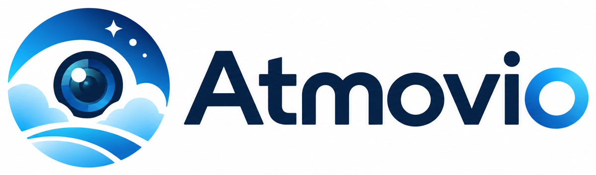

<p align="center">
  <br>
  <sub>Raspberry Pi 5 NVR with AI sky watching – one-command install, plain-language admin</sub><br>
  <sub><i>formerly SkyWatch (≤ 3.4)</i></sub>
</p>

<p align="center">
  <a href="https://www.atmovio.com/"><b>atmovio.com</b></a> ·
  <a href="README.cs.md">🇨🇿 Česky</a> ·
  <a href="docs/install.md">Install</a> ·
  <a href="docs/hardware.md">Hardware</a> ·
  <a href="docs/cameras.md">Cameras</a> ·
  <a href="docs/ai.md">AI sky watching</a> ·
  <a href="docs/webhook.md">Webhook</a> ·
  <a href="#home-assistant--rest-api">🏠 Home Assistant</a> ·
  <a href="docs/api.md">REST API</a> ·
  <a href="docs/vpn.md">VPN</a> ·
  <a href="docs/faq.md">FAQ</a> ·
  <a href="examples/">Examples</a> ·
  <a href="https://www.atmovio.com/donate/">♥ Support</a>
</p>
<p align="center">
  <a href="https://www.atmovio.com/donate/"></a>
  <a href="https://github.com/VladimirVecera/atmovio/releases/latest"></a>
  <a href="#home-assistant--rest-api"></a>
  <a href="docs/api.md"></a>
</p>

Atmovio turns a **Raspberry Pi 5** with a USB hard drive into a home video recorder for IP cameras
(**[Frigate](https://frigate.video)** does the recording) and adds something Frigate does not do:
it watches the **sky** through your cameras and tells you when something beautiful or dangerous is
happening – red sunsets, shelf clouds, mammatus, rainbows, halos, lightning, fog…

It is built for people who are not sysadmins. Everything is in one web page, in plain language,
and the installer asks only what it really needs.

> The web UI is currently in **Czech**. Documentation is in English and Czech. An English UI is on the
> roadmap – contributions welcome (see [CONTRIBUTING.md](CONTRIBUTING.md)).

## What you get

| | |
|---|---|
| **Recording** | Continuous H.264/H.265 recording of any RTSP camera without re-encoding, playback and clip export via Frigate. Retention in days. Works without the HDD too (live view only). |
| **Camera setup that just works** | Finds cameras on the LAN (ONVIF + port scan), tests every stream for *real video frames* before saving, fixes wrong ports, explains errors in human words. Remote cameras over WireGuard. |
| **AI sky watching** | Every few minutes a snapshot goes to a vision model (Google Gemini free tier by default; Groq, OpenAI, Anthropic, Ollama also supported). The model returns a 0–10 score and the phenomena it sees; you choose which ones to be alerted about. Watches from dawn to dusk (nautical twilight), skips unchanged or dark frames to save your daily quota. Episodes and cooldowns prevent alert storms. |
| **Alerts** | E-mail (SMTP) and/or a **webhook to your own website** (status + snapshots every minute, alerts with the AI image). Camera / recording / disk outage alerts with recovery. |
| **Videos** | Cut a clip around any detection (−N/+M minutes) or let Atmovio do it **automatically after each alert**; watch it in the browser at up to 120×, download MP4, optional 25× timelapse export. |
| **Per-camera page** | Everything about one camera in one place: live view, status, AI toggles, detections, videos, stream settings. |
| **Ops for humans** | Disk health (SMART) with plain-language warnings, storage guard that keeps the system alive when the HDD disappears, logs with search, one-file updater with automatic rollback. |
| **Integrations** | Read-only **REST API** with API keys (Home Assistant, dashboards, scripts) and a documented outbound webhook. Ready-to-run examples: [PHP scripts](examples/api-php), [Home Assistant YAML](examples/home-assistant), [webhook receiver](examples/webhook-php). |

## Hardware

| | |
|---|---|
| **Board** | **Raspberry Pi 5**, 4 GB minimum, 8 GB recommended. Only the Pi 5 is tested and supported (the installer requires 64-bit ARM and warns on other models). Pi 4 is not supported – recording would work, but previews and AI snapshots are CPU-bound. |
| **System** | Raspberry Pi OS Lite 64-bit (Debian 12/13) on an SSD (recommended) or an SD card. |
| **Recordings** | USB 3 hard drive (ext4; the installer formats it safely, never the system disk). Sizing: bitrate of all cameras in Mbit/s × 10.8 ≈ GB/day – e.g. two 4 Mbit/s cameras ≈ 86 GB/day, 600 GB/week. Optional: without it Atmovio runs in live-view mode. |
| **Power & cooling** | the official 27 W supply (bus-powered HDD) and an active cooler. |
| **Network** | wired Ethernet; remote cameras over WireGuard. |
| **Cameras** | any IP camera with RTSP H.264/H.265, ONVIF preferred; 4–6 cameras per Pi 5 is comfortable. |

Details, sizing table and a tested setup: [docs/hardware.md](docs/hardware.md).

## Quick start

```sh
curl -fsSL -o install.sh https://github.com/VladimirVecera/atmovio/releases/latest/download/install.sh
sudo bash install.sh
```

The installer is downloaded from the [latest release](https://github.com/VladimirVecera/atmovio/releases/latest) and must run
from an interactive terminal (it asks questions, so `curl | bash` is refused on purpose).
Prefer `git clone`? `install.sh` is in the repository root too: `git clone https://github.com/VladimirVecera/atmovio.git && cd atmovio && sudo bash install.sh`
(`main` may be work in progress; releases are always tested).

The installer asks for an admin password (min. 12 characters), retention, time zone, optional SMTP and
which disk to use for recordings (existing ext4 is reused, formatting requires typing `SMAZAT`). It installs
Docker, Frigate 0.17, Portainer, Cockpit and Atmovio. Then open `http://<RPI-IP>` and follow the
4-step checklist on the dashboard: add cameras → disk → alerts → AI key.

Updating later: the web UI tells you when a new release exists and installs it on one click
(Nastavení → Systém → Aktualizace); or over SSH: `curl -fsSL -o update-atmovio.sh https://github.com/VladimirVecera/atmovio/releases/latest/download/update-atmovio.sh && sudo bash update-atmovio.sh`.
Either way it backs up, verifies and rolls back on failure.

Full guide: [docs/install.md](docs/install.md).

> ♥ **Atmovio is free and stays free.** If it saves you time, [support the project](https://www.atmovio.com/donate/) – any amount, QR payment or bank transfer, no registration.

## Services after install

| Service | URL | Purpose |
|---|---|---|
| Atmovio | `http://IP` | the admin you actually use |
| Frigate | `https://IP:8971` | recordings player, clip export (user `admin`, same password) |
| Cockpit | `https://IP:9090` | system: network, disks, updates |
| Portainer | `https://IP:9443` | containers (rarely needed) |

Atmovio uses plain HTTP on purpose – run it in your LAN or behind your router's VPN. **Never expose port 80 to the internet.**
For remote viewing use the [webhook](docs/webhook.md) (push to your website) or a VPN.

## Home Assistant & REST API

Atmovio is not a closed box. Everything it knows – status, cameras, live snapshots, AI detections, videos, events – is a
`GET` away, with API keys you create in the admin. **Home Assistant needs no custom component**: the built-in REST
integration is enough.

```yaml
rest:
  - resource: http://192.168.1.20/api/v1/status
    headers: {Authorization: "Bearer at_…"}
    sensor:
      - name: Atmovio AI requests today
        value_template: "{{ value_json.ai.used_today }}"
    binary_sensor:
      - name: Atmovio recording
        value_template: "{{ value_json.frigate.online }}"
camera:
  - platform: generic
    name: Garden sky
    still_image_url: http://192.168.1.20/api/v1/cameras/zahrada/snapshot.jpg?api_key=at_…
```

| | |
|---|---|
| 🏠 **Home Assistant** | [`examples/home-assistant`](examples/home-assistant) – sensors, camera entity, last-alert sensor and a phone notification with the picture |
| 🔌 **REST API** | [`docs/api.md`](docs/api.md) – every endpoint and field; [`examples/api-php`](examples/api-php) – working PHP scripts (status, cameras, detections gallery, videos, cron poller) |
| 📤 **Webhook** | [`docs/webhook.md`](docs/webhook.md) – Atmovio pushes status + alerts to your website; [`examples/webhook-php`](examples/webhook-php) – drop-in receiver |

More on the web: [atmovio.com/api](https://www.atmovio.com/api/).

## How the AI part works

1. From dawn to dusk (configurable: civil / nautical / astronomical twilight or fixed minutes) Atmovio grabs one full-resolution frame per camera every *N* minutes (faster around sunrise/sunset).
2. Dark frames and frames that did not change since the last evaluation are skipped without an AI call.
3. The model receives a catalogue of phenomena and returns a score and what it sees. Detections at or above your threshold trigger an alert – once per *episode* (a 40-minute sunset is one alert, not ten).
4. Alerts go to e-mail and/or your webhook with the snapshot. Optionally a video clip is exported automatically.
5. Everything is visible in **Historie** (history), per-camera pages and the dashboard; daily statistics are kept independently of history clean-up.

**No neural network runs on the Pi.** Atmovio sends one JPEG to a hosted vision model with a fixed question
("how interesting is this sky 0–10 and which of these phenomena do you see?") and parses the JSON answer. Supported providers:
**Google Gemini** (free tier, default – Flash-Lite picked automatically, hundreds of requests/day), **Groq** and **OpenRouter**
(free models, OpenAI-compatible), **OpenAI** and **Anthropic** (paid, most accurate), and **Ollama** on the Pi itself
(free and offline, but slow and less accurate). Only single snapshots ever leave the Pi; recordings never do.
The catalogue has 21 phenomena (red sky, shelf cloud, mammatus, altocumulus, thunderstorm, lightning, rainbow, halo, crepuscular
rays, lenticular, fog, funnel cloud, wall cloud, roll cloud, asperitas, hail core, shower, virga, rain, snow, other) – you pick
which ones alert you and the threshold. Details, quotas and tuning: [docs/ai.md](docs/ai.md).

## Repository layout

```
install.sh              built installer (do not edit – generated)
update-atmovio.sh      built updater (generated)
src/
  build.sh              builds the two scripts above from the templates + app
  install.template.sh   installer source
  update.template.sh    updater source
  atmovio/
    app.py              the whole web app (FastAPI + Jinja templates inside)
    storage_guard.py    HDD watchdog / Frigate live-vs-recording switch
    static/             CSS + JS (Pico CSS, Alpine.js vendored at install time)
docs/                   documentation (en) and docs/cs (Czech)
examples/
  api-php/              PHP client + scripts for the REST API (status, cameras, detections, videos, cron poller)
  home-assistant/       configuration.yaml + automations.yaml (REST integration)
  webhook-php/          drop-in PHP receiver + status page for the webhook
```

Development: `bash src/build.sh` after any change in `src/`, `bash src/build.sh --check` verifies that the built
scripts match. Run `python3 -m py_compile src/atmovio/app.py`; a lightweight local run is possible with
`ATMOVIO_DIR=/tmp/sw ATMOVIO_PORT=8099 ATMOVIO_ADMIN_PASSWORD=… python3 src/atmovio/app.py` (Frigate features will show as offline).

## Support the project

Atmovio is free and has no paid tier. If it saves you time, you can support the server costs and further development –
any amount, by QR payment or bank transfer: **[atmovio.com/donate](https://www.atmovio.com/donate/)**.
A ⭐ on this repository and reports of which cameras work help just as much.

## Contributing

Issues and pull requests are welcome – bug reports with logs (**Logy** page → download), camera models that
did or did not work, translations, new phenomena, integrations. Please read [CONTRIBUTING.md](CONTRIBUTING.md)
and [SECURITY.md](SECURITY.md).

## License

[MIT](LICENSE) © 2026 Vladimír Večeřa. Frigate, Pico CSS and Alpine.js are separate projects under their own licenses.
